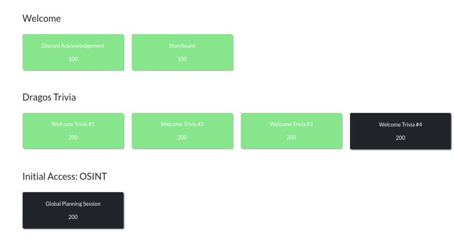
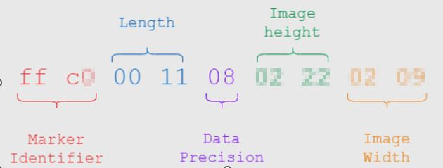
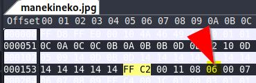
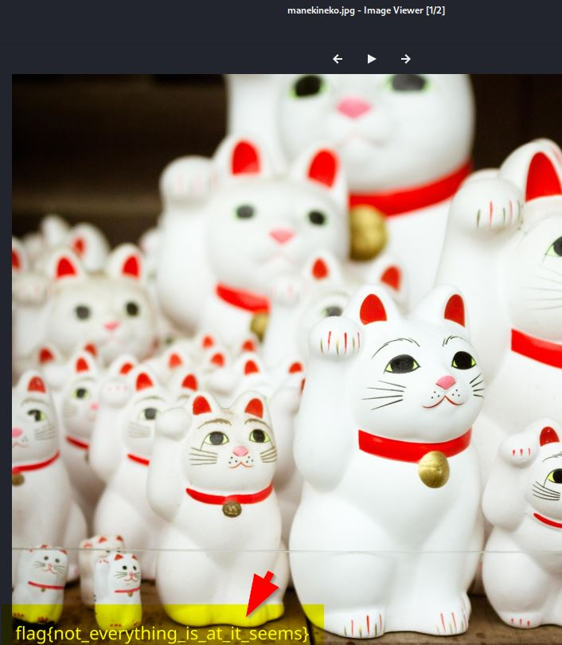

# Challenge : Global Session planning


Initial Access: OSINT "Global Session planning" (200 points)


## Pre-Analysis

The usual checks, but this gave nothing...
```
sudo wget -O /usr/bin/jsteg https://github.com/lukechampine/jsteg/releases/download/v0.1.0/jsteg-linux-amd64--2023-11-04 11:25:52-- https://github.com/lukechampine/jsteg/releases/download/v0.1.0/jsteg-linux-amd64

sudo chmod +x /usr/bin/jsteg
jsteg reveal manekineko.jpg
exiftool manekineko.jpg
strings -10 manekineko.jpg
hexdump -C manekineko.jpg |  less +/"ff d9"
xxd -c1 -p manekineko.jpg  | tr "\\n" " " | sed -n -e 's/.*\\ ( ff d9 \\)\\ (.*\\).*/\\2/p' | xxd -r -p
exiv2 manekineko.jpg
binwalk  manekineko.jpg
```

```
jsteg reveal manekineko.jpg
could not decode jpeg:unsupported JPEG feature: progressive decoding
```

## Analysis

I finally used outguess-extract and got an interesting clue as below:

```
outguess-extract manekineko.jpg test.jpg
Reading manekineko.jpg....
Corrupt JPEG data: 8332 extraneous bytes before marker 0xc4
```

Having an “extraneous bytes before marker” was a sign that the probable technique used was a change of size of the picture !
Based on some links from cyberhacktics  and  hackmd.io  I got the tip to edit the JPG Height starting at the FFC2 marker.
On kali I used the practical wxhexEditor and updated the first byte for the height  (04  to 06)

<https://blog.cyberhacktics.com/hiding-information-by-changing-an-images-height/>

<https://hackmd.io/@XeusNguyen/S1DdU66Zo>





It is interesting to note that the initial marker pointed 0xC4 is DHT 0xFF, 0xC4  variable size Define Huffman Table(s) Specifies one or more Huffman tables.
\

So in this case we want to increase the height...




And there it is ...




# FLAG

```
flag{not_everything_is_as_it_seems}
```