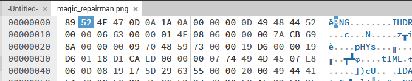
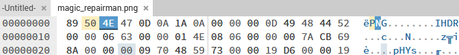
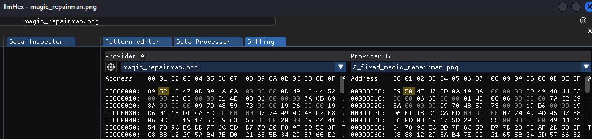
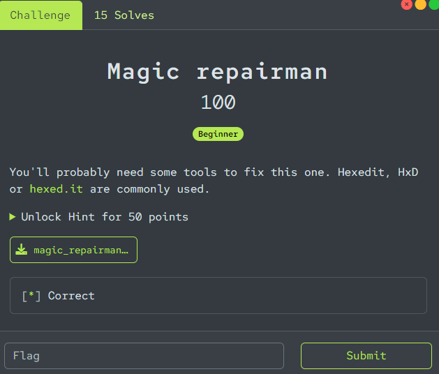

# Analysis

## Step 1: magic header analysis

Open the file in [  hex editor.](https://hexed.it/)

By default Hex editor does not recognize the file as PNG but we know for a fact it is a PNG.




## Step 2: Fix magic header

Let's fix the header:

```
‰RNG (hex: 89 52 4E 47)
```

Replace the modified header with the correct PNG header
```
‰PNG (hex: 89 50 4E 47)
```
Save the modified file.





## Step 3: compare with imhex

We retrieve the difference of header modified with imhex:




# FIX: a more advanced fix in python

We add in a python script the header modification and also a CRC checker/fixer
Verify Chunk CRCs: Fix CRCs: The function fix_crc iterates over each chunk in the PNG file, recalculates the CRC for the chunk, and fixes it if necessary.
Note : In this case in fact it is not necessary

```python
$ python png_fixer.py 
File saved as fixed_magic_repairman.png
```

## FLAG !

Fixing the header is sufficient in this case to open the PNG and find the flag:


```text
leveleffect{corrupted_magic_purification}
```

## Confirmation of flag status

Correct!



Let's confirm the detailed sections of the file:
```
pngcheck -cvt 2_fixed_magic_repairman.png
zlib warning:  different version (expected 1.2.13, using 1.3)

File: 2_fixed_magic_repairman.png (17315 bytes)
  chunk IHDR at offset 0x0000c, length 13
    1635 x 334 image, 32-bit RGB+alpha, non-interlaced
  chunk pHYs at offset 0x00025, length 9: 6614x6614 pixels/meter (168 dpi)
  chunk tIME at offset 0x0003a, length 7: 13 Jun 2024 08:25:23 UTC
  chunk IDAT at offset 0x0004d, length 8192
    zlib: deflated, 32K window, default compression
  chunk IDAT at offset 0x02059, length 8192
  chunk IDAT at offset 0x04065, length 810
  chunk IEND at offset 0x0439b, length 0
No errors detected in 2_fixed_magic_repairman.png (7 chunks, 99.2% compression).
```


## Extra investigations on PNG Format

Ath the begining, with pngcheck we have a zlib warning:

```bash
$ pngcheck magic_repairman.png 
zlib warning:  different version (expected 1.2.13, using 1.3)

magic_repairman.png  this is neither a PNG or JNG image nor a MNG stream
ERROR: magic_repairman.png

```

We can confirm also the challenge is just about the magic header, nothing to see with binwalk:
```
$ binwalk magic_repairman.png

DECIMAL       HEXADECIMAL     DESCRIPTION
-----------------------------------------------------------
```

zteg also refuse to work on files with incorrect headers
```
zsteg -a magic_repairman.png
[!] #<ZPNG::NotSupported: Unsupported header "\x89RNG\r\n\x1A\n" in #<File:magic_repairman.png>>
```

The error message encountered indicate that there may be more issues with the file beyond just the header modification. 

The zlib warning suggests that there might be a problem with the compression data within the file. However, since the structure of the file includes recognizable PNG chunks (IHDR, pHYs, IDAT), it is worth trying to investigate and fix the file further.

Let's review the PNG file format.

PNG files use CRC (Cyclic Redundancy Check) for each chunk to ensure data integrity. Corrupted CRCs could prevent the file from being recognized as a valid PNG.

* IHDR Chunk: This is the first chunk in a PNG file, containing information about the image such as width, height, bit depth, color type, compression method, filter method, and interlace method.
*pHYs Chunk: Contains the pixel dimensions of the image
*IDAT Chunk: Contains the actual image data, which is compressed using zlib.
*IEND Chunk: Marks the end of the PNG file


```
+-----------------------------+
|   PNG File Structure        |
+-----------------------------+
|  Magic Header (8 bytes)     |
|  \x89PNG\r\n\x1a\n         |
+-----------------------------+
|  IHDR Chunk (13 bytes)      |
|  +------------------------+ |
|  | Length (4 bytes)       | |
|  +------------------------+ |
|  | Type: IHDR (4 bytes)   | |
|  +------------------------+ |
|  | Data:                 |  |
|  |  Width (4 bytes)      |  |
|  |  Height (4 bytes)     |  |
|  |  Bit Depth (1 byte)   |  |
|  |  Color Type (1 byte)  |  |
|  |  Compression (1 byte) |  |
|  |  Filter (1 byte)      |  |
|  |  Interlace (1 byte)   |  |
|  +------------------------+ |
|  | CRC (4 bytes)         |  |
|  +------------------------+ |
+-----------------------------+
|  pHYs Chunk (9 bytes)       |
|  +------------------------+ |
|  | Length (4 bytes)       | |
|  +------------------------+ |
|  | Type: pHYs (4 bytes)   | |
|  +------------------------+ |
|  | Data:                 |  |
|  |  Pixels per unit X    |  |
|  |  Pixels per unit Y    |  |
|  |  Unit specifier       |  |
|  +------------------------+ |
|  | CRC (4 bytes)         |  |
|  +------------------------+ |
+-----------------------------+
|  IDAT Chunk (varies)        |
|  +------------------------+ |
|  | Length (4 bytes)       | |
|  +------------------------+ |
|  | Type: IDAT (4 bytes)   | |
|  +------------------------+ |
|  | Data (compressed):    |  |
|  |  zlib compressed data |  |
|  +------------------------+ |
|  | CRC (4 bytes)         |  |
|  +------------------------+ |
+-----------------------------+
|  IEND Chunk (0 bytes)       |
|  +------------------------+ |
|  | Length (4 bytes)       | |
|  +------------------------+ |
|  | Type: IEND (4 bytes)   | |
|  +------------------------+ |
|  | CRC (4 bytes)         |  |
|  +------------------------+ |
+-----------------------------+
```

In the end, the CRC are OK and Zlib only warnings (need to improve how it is processed) as per below check:
```
└─$ python png_crc_check.py 1_fixed_magic_repairman.png
PNG CRC Check
+------+--------+-------------------+---------------------+-------------------+----------------+
| Index| Chunk  |    Expected CRC   |    Actual CRC       | CRC Status        | Zlib Status    |
+------+--------+-------------------+---------------------+-------------------+----------------+
| N/A  | IHDR   | 0x7ACB698A       | 0x7ACB698A           | OK                | N/A
+------+--------+-------------------+---------------------+-------------------+----------------+
| 0    | pHYs   | 0x18D1CAED       | 0x18D1CAED           | OK                | N/A
+------+--------+-------------------+---------------------+-------------------+----------------+
| 1    | tIME   | 0x5D296355       | 0x5D296355           | OK                | N/A
+------+--------+-------------------+---------------------+-------------------+----------------+
| 2    | IDAT   | 0xBAF5479B       | 0xBAF5479B           | OK                | Zlib Warning
+------+--------+-------------------+---------------------+-------------------+----------------+
| 3    | IDAT   | 0x88F1DCEA       | 0x88F1DCEA           | OK                | Zlib Warning
+------+--------+-------------------+---------------------+-------------------+----------------+
| 4    | IDAT   | 0xE9C9D93B       | 0xE9C9D93B           | OK                | Zlib Warning
+------+--------+-------------------+---------------------+-------------------+----------------+
| 5    | IEND   | 0xAE426082       | 0xAE426082           | OK                | N/A
+------+--------+-------------------+---------------------+-------------------+----------------+

Verbose Error Details:
Zlib versions: Expected 1.2.13, using 1.3
+-------+--------+-------------------+---------------------+-------------------+--------------------+
| Index |
+-------+--------+-------------------+---------------------+-------------------+--------------------+
  Expected compression method hex values: ['7801', '785E', '789C', '78DA', '78BB', '78F9',
  '776D', '77BD', '77FB', '779C', '765D', '769D', '76DC', '76FB', '753E', '757E', '75BE', '75 FD']
+-------+--------+-------------------+---------------------+-------------------+--------------------+
| Index = 2
+------+--------+-------------------+---------------------+-------------------+--------------------
Chunk IDAT at offset 0x00000049: Error -5 while decompressing data: incomplete or truncated stream
  Collected value: 789C
+------+--------+-------------------+---------------------+-------------------+--------------------
| Index = 3
+------+--------+-------------------+---------------------+-------------------+--------------------
Chunk IDAT at offset 0x00002055: Error -3 while decompressing data: incorrect header check
  Collected value: 05AB
+------+--------+-------------------+---------------------+-------------------+--------------------
| Index = 4
+------+--------+-------------------+---------------------+-------------------+--------------------
Chunk IDAT at offset 0x00004061: Error -3 while decompressing data: unknown compression method
  Collected value: 0000
+------+--------+-------------------+---------------------+-------------------+--------------------
```