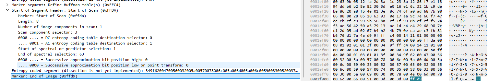
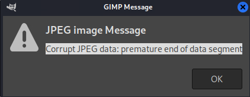

# Challenge

Double take  (200pts) - Intermediate

I'm sure this image is hiding something, but nothing stands out no matter how I look at it. Maybe it's just stringing me along...

File attached: doubletake.jpg

## Pre-Analysis

1./Analyse the file structure and markers with Wireshark Version 4.2.6 that have JPEG dissectors.

Ref to [wireshark_analysis.txt](./wireshark_analysis.txt) for the detailed result.




2/Use Stegano tools like outguess-extract: we have a hint !

```bash
└─$ outguess-extract  
OutGuess 0.4 Universal Stego 1999-2021 Niels Provos and others

└─$ outguess-extract  doubletake.jpg test1.jpg
Reading doubletake.jpg....
Corrupt JPEG data: 78 extraneous bytes before marker 0xd9
Writing 0 bits
```

3./With jsteg we got confirmation that the JPEG is in "progressive decoding" format:

```bash
sudo wget -O /usr/bin/jsteg https://github.com/lukechampine/jsteg/releases/download/v0.1.0/jsteg-linux-amd64
sudo chmod +x /usr/bin/jsteg
─$ jsteg reveal doubletake.jpg                                              
could not decode jpeg:unsupported JPEG feature: progressive decoding
```

4./Use jpeg_SOFX3 and jpeg_ffd9 tools to check the file format:

```bash
─$ ./jpeg_SOFX3 doubletake.jpg                                                                        
JPEG Information:
91 extraneous bytes found before marker 0xD9
Marker: 0xc2
Width: 21250 pixels
Height: 22278 pixels
Precision: 8 bits
Raw Data:
Length: 4352 bytes
Precision: 8
Height: 22278
Width: 21250
Width HEX: 0x5302
Height HEX: 0x5706
Width Offset: 194
Height Offset: 192

EOI marker found at position: 126989 (0x1f00d)

```

```bash
└─$ ./jpeg_ffd9 doubletake.jpg                                                                          
Last FFD9 marker found at position: 126987 (0x1f00b)
0001f000: 00 6c 00 66 00 51 00 3d 00 3d 00 ff d9            .l.f.Q.=.=...   

```

```
0x0001f00b in hexadecimal is 1 * 16^4 + 15 * 16^3 + 0 * 16^2 + 0 * 16^1 + 11 * 16^0
Which equals 1 * 65536 + 15 * 4096 + 0 * 256 + 0 * 16 + 11
This simplifies to 65536 + 61440 + 0 + 0 + 11
Which equals 126987
```


5./To detect JPEG error, use gimp error logs. Locate error by observing the output of gimp, such as:


6./Use gimp error messages:




7./Refer to the detailed Format JPEG (provided in  imhex source):

```bash
#pragma author WerWolv
#pragma description JPEG Image Format

import std.io;
import std.mem;
import type.magic;
#pragma endian big

#pragma MIME image/jpeg
enum Marker : u8 {
    TEM     = 0x01,
    SOF0    = 0xC0,
    SOF1    = 0xC1,
    SOF2    = 0xC2,
    SOF3    = 0xC3,
    DHT     = 0xC4,
    SOF5    = 0xC5,
    SOF6    = 0xC6,
    SOF7    = 0xC7,
    SOI     = 0xD8,
    EOI     = 0xD9,
    SOS     = 0xDA,
    DQT     = 0xDB,
    DNL     = 0xDC,
    DRI     = 0xDD,
    DHP     = 0xDE,
    APP0    = 0xE0,
    APP1    = 0xE1,
    APP2    = 0xE2,
    APP3    = 0xE3,
    APP4    = 0xE4,
    APP5    = 0xE5,
    APP6    = 0xE6,
    APP7    = 0xE7,
    APP8    = 0xE8,
    APP9    = 0xE9,
    APP10   = 0xEA,
    APP11   = 0xEB,
    APP12   = 0xEC,
    APP13   = 0xED,
    APP14   = 0xEE,
    APP15   = 0xEF,
    COM     = 0xFE
};

```


##

JPEG files typically end with the marker 0xFFD9.

let's extract the last 78 bytes before the 0xd9 marker with dd.
We can imediately observe that "it looks like base64 format":

```bash
$ dd if=doubletake.jpg of=extraneous_bytes.bin bs=1 skip=$(( $(stat -c%s doubletake.jpg) - 78 )) count=78
78+0 records in
78+0 records out
78 bytes copied, 0.0029347 s, 26.6 kB/s

$ xxd extraneous_bytes.bin
00000000: 5600 3200 5a00 5700 7800 6c00 5a00 6d00  V.2.Z.W.x.l.Z.m.
00000010: 5a00 6c00 5900 3300 5200 3700 6300 3200  Z.l.Y.3.R.7.c.2.
00000020: 3500 6c00 5900 5700 7400 3500 5800 3300  5.l.Y.W.t.5.X.3.
00000030: 5600 3000 5a00 6900 3000 7800 4e00 6d00  V.0.Z.i.0.x.N.m.
00000040: 7800 6c00 6600 5100 3d00 3d00 ffd9       x.l.f.Q.=.=...
```

V2ZWxlZmZlY3R7c25lYWt5X3V0Zi0xNmxlfQ== | FAIL as base64 flag
V2ZWxlZmZlY3R7c25lYWt5X3V0Zi0xNmxlfQ= | FAIL as base64 flag

Check with less
```bash
filesize=$(stat -c%s "doubletake.jpg")
skip_bytes=$((filesize - 78 - 2))
dd if=doubletake.jpg of=extraneous_bytes_noffd9.bin bs=1 skip=$skip_bytes count=78

$ xxd extraneous_bytes_noffd9.bin 
00000000: 4700 5600 3200 5a00 5700 7800 6c00 5a00  G.V.2.Z.W.x.l.Z.
00000010: 6d00 5a00 6c00 5900 3300 5200 3700 6300  m.Z.l.Y.3.R.7.c.
00000020: 3200 3500 6c00 5900 5700 7400 3500 5800  2.5.l.Y.W.t.5.X.
00000030: 3300 5600 3000 5a00 6900 3000 7800 4e00  3.V.0.Z.i.0.x.N.
00000040: 6d00 7800 6c00 6600 5100 3d00 3d00       m.x.l.f.Q.=.=.

```

To match the message "74 extraneous bytes before marker 0xd9", the dd command should be adjusted to skip the appropriate number of bytes from the end of the file. The 0xd9 marker itself is 2 bytes (0xffd9), so you should skip the total file size minus 76 bytes (74 bytes + 2 bytes for the marker).

```bash
filesize=$(stat -c%s "doubletake.jpg")
skip_bytes=$((filesize - 76))
dd if=doubletake.jpg of=74extraneous_bytes.bin bs=1 skip=$skip_bytes count=74

$ xxd 74extraneous_bytes.bin 
00000000: 3200 5a00 5700 7800 6c00 5a00 6d00 5a00  2.Z.W.x.l.Z.m.Z.
00000010: 6c00 5900 3300 5200 3700 6300 3200 3500  l.Y.3.R.7.c.2.5.
00000020: 6c00 5900 5700 7400 3500 5800 3300 5600  l.Y.W.t.5.X.3.V.
00000030: 3000 5a00 6900 3000 7800 4e00 6d00 7800  0.Z.i.0.x.N.m.x.
00000040: 6c00 6600 5100 3d00 3d00                 l.f.Q.=.=.G
```

playing with the sizes...
a)remove extra = chars and test

```python
└─$ python extract_decode_extraenous_bytes.py
Hex Bytes:
00000000: 56 00 32 00 5a 00 57 00 78 00 6c 00 5a 00 6d 00
00000010: 5a 00 6c 00 59 00 33 00 52 00 37 00 63 00 32 00
00000020: 35 00 6c 00 59 00 57 00 74 00 35 00 58 00 33 00
00000030: 56 00 30 00 5a 00 69 00 30 00 78 00 4e 00 6d 00
00000040: 78 00 6c 00 66 00 51 00 3d 00 3d 00 ff d9
Cleaned Base64 String: V2ZWxlZmZlY3R7c25lYWt5X3V0Zi0xNmxlfQ==
```

let's try to adjust sizes and decode with base64:

```python
V2ZWxlZmZlY3R7c25lYWt5X3V0Zi0xNmxlfQ= | FAIL
2ZWxlZmZlY3R7c25lYWt5X3V0Zi0xNmxlfQ=  | FAIL
ZWxlZmZlY3R7c25lYWt5X3V0Zi0xNmxlfQ=   | SUCCESS
```

## FLAG !
ZWxlZmZlY3R7c25lYWt5X3V0Zi0xNmxlfQ=   convert to eleffect{sneaky_utf-16le} !

Just readapt to leveleffect{FLAG}:

```
leveleffect{sneaky_utf-16le}
```