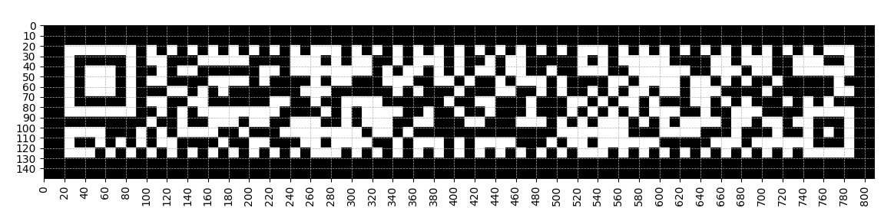
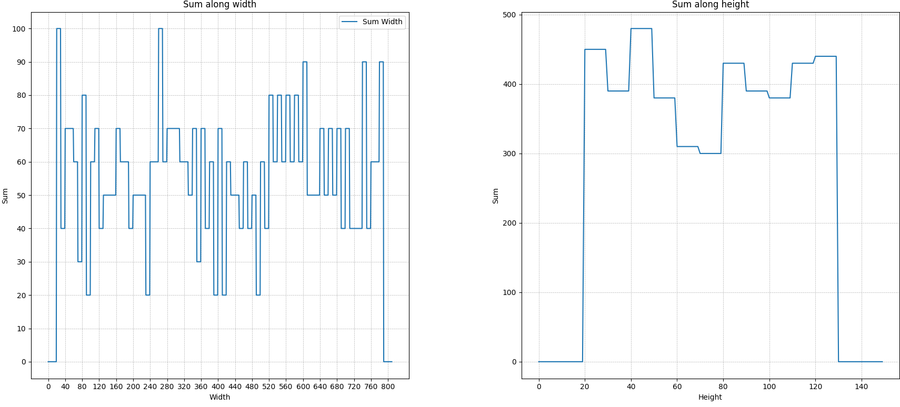

# Challenge

QRRRRRRRR - 50 points - Warmups - easy
Author: @JohnHammond

Wait a second, they made QR codes longer!?!

Attachment: qrrrrrrrr.png

## Analysis 1

RMQR (rectangular) are based on REF ISO/IEC 23941.
Algorithms used in QR codes:
* Bresenham's line algorithm <https://en.wikipedia.org/wiki/Bresenham's_line_algorithm>
* Reed-Solomon (ref to Galois field), Refer to <https://github.com/gurushida/qrcode/blob/master/reedsolomon.h>

## Analysis 2: get the size and details of the QR code

```
python .\rmqrdecode3.py
Image width: 810
Image height: 150
```

Now let's verify visually the size and proportions of the QR code

```
python .\rmqrdecode5.py
```




Let's approximate the number of modules 
```
python .\rmqrdecode4.py
Number of modules in width: 62
Number of modules in height: 12
```
...but from https://www.qrcode.com/en/codes/rmqr.html we know that the QR size should be adjusted to an R11x59.

We can check transitions in the sum arrays, it seems that we have 11 bumps with a "Sum along height" analysis:



## Analysis 3: build ZXingReader

Let's decode the RMQR with maximum of details and ability to dig further..., for that we will compile zxing-cpp:


Extra step, I add some debug on the number of bytes extracted...
```cpp
void TextDecoder::Append(std::string& str, const uint8_t* bytes, size_t length, CharacterSet charset, bool sjisASCII)
{
	int eci = ToInt(ToECI(charset));
	const size_t str_len = str.length();
	const int bytes_len = narrow_cast<int>(length);
	constexpr unsigned int replacement = 0xFFFD;
	const unsigned int flags = ZUECI_FLAG_SB_STRAIGHT_THRU | (sjisASCII ? ZUECI_FLAG_SJIS_STRAIGHT_THRU : 0);
	int utf8_len;

	if (eci == -1)
		eci = 899; // Binary

	int error_number = zueci_dest_len_utf8(eci, bytes, bytes_len, replacement, flags, &utf8_len);
	if (error_number >= ZUECI_ERROR)
		throw std::runtime_error("zueci_dest_len_utf8 failed");

	str.resize(str_len + utf8_len); // Precise length
	unsigned char *utf8_buf = reinterpret_cast<unsigned char *>(str.data()) + str_len;

	error_number = zueci_eci_to_utf8(eci, bytes, bytes_len, replacement, flags, utf8_buf, &utf8_len);
	if (error_number >= ZUECI_ERROR) {
		str.resize(str_len);
		throw std::runtime_error("zueci_eci_to_utf8 failed");
	}
	assert(str.length() == str_len + utf8_len);
	std::cout << "Debug: str length = " << str.length() << std::endl;
	std::cout << "Debug: str_len + utf8_len = " << str_len + utf8_len << std::endl;
}
```

```
git clone https://github.com/zxing-cpp/zxing-cpp.git --recursive --single-branch --depth 1
cmake -S zxing-cpp -B zxing-cpp.release -DCMAKE_BUILD_TYPE=Release
cmake --build zxing-cpp.release -j8 --config Release

└─$ find . -name ZXingReader
./zxing-cpp.release/example/ZXingReader

─$ sudo cp ./zxing-cpp.release/example/ZXingReader /usr/bin/.

└─$ ZXingReader --version
ZXingReader 2.2.1
```

## Analysis 4: decoding the RMQR

Note : with extra debug mode I display explicitly that there is no errors recoverd via reed-solomon Algo and confrim 38 bytes 
```

$  ZXingReader qrrrrrrrr.png
No errors to correct.
...
Error: No error locations found.
Text:       "Debug: str length = 6
...
Debug: str_len + utf8_len = 38
flag{a44557e380e3baae9c21c738664c6142}"
Bytes:      66 6C 61 67 7B 61 34 34 35 35 37 65 33 38 30 65 33 62 61 61 65 39 63 32 31 63 37 33 38 36 36 34 63 36 31 34 32 7D
Format:     rMQRCode
Identifier: ]Q1
Content:    Text
HasECI:     false
Position:   20x20 790x20 790x130 20x130
Rotation:   0 deg
IsMirrored: false
IsInverted: false
EC Level:   M
Version:    14
```


## FLAG

```
66 -> f
6C -> l
61 -> a
67 -> g
7B -> {
61 -> a
...
```

So we get the flag, not the fastest method (much faster with QRQR mobile application but much deeper analysis capabilities ;-)
```
flag{a44557e380e3baae9c21c738664c6142}
```

## MISC

## Details and spec

ISO/IEC 23941

ref <https://en.m.wikipedia.org/wiki/Rectangular_Micro_QR_Code>

<https://github.com/shogo82148/qrcode/blob/main/rmqr/decode.go>

<https://docs.aspose.com/barcode/net/qr-micro-qr-and-rmqr/>

<https://github.com/OUDON/rmqrcode-python>

<https://www.qrcode.com/en/codes/rmqr.html>

<https://github.com/soya-daizu/goban>

<https://www.keyence.com/ss/products/auto_id/codereader/basic_2d/qr.jsp>

(sample) <https://cdn.standards.iteh.ai/samples/77404/e103bf2d1f0d4162b34ca493efdaf9c4/ISO-IEC-23941-2022.pdf>


<https://en.wikiversity.org/wiki/Reed%E2%80%93Solomon_codes_for_coders>

<https://github.com/souvikshanku/simqr>

<https://tomverbeure.github.io/2022/08/07/Reed-Solomon.html>

<https://research.swtch.com/field>

<https://observablehq.com/@zavierhenry/encoding-qr-codes>

<https://www.qrcode.com/en/codes/rmqr.html>

<https://github.com/Slamy/YetAnother2dCodeDecoder>

<https://zint.org.uk/manual/chapter/6/6>

<https://github.com/shogo82148/qrcode/tree/main/rmqr>

<https://github.com/soya-daizu/goban>

<https://github.com/soya-daizu/goban/blob/master/src/goban/rmqr/decoder.cr>

Paragraphe 6.6.4 Rectangular Micro QR Code (rMQR) (ISO 23941)  de <https://zint.org.uk/manual/chapter/6/6>

## Other Writeups

<https://medium.com/@inferiorak/qrrrrrrrr-nahamcon-ctf-2024-writeup-by-inferiorak-063406df187e>
