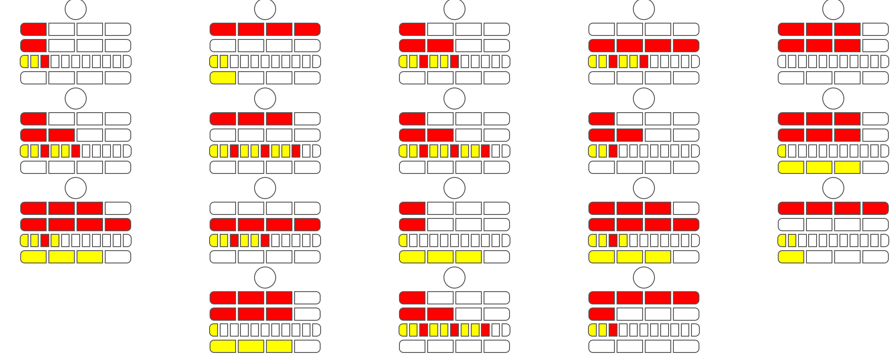
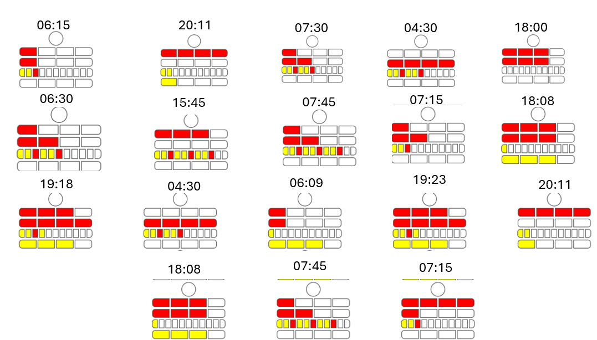

# Challenge Dorsolateral Description

Dorsolateral prefrontal right cortex 

Mr Wellington recently suffered from a hit on the head and has been acting eratically, waving his hands and arms in all directions. The hit seems to have caused this and could have affected the dorsolateral prefrontal.


## Analysis - Reconaissance Step 1

Attached file is below diagram...




A google reverse image and some research conduct to the point that the diagrams observed are in [Mengenlehreuhr](https://en.wikipedia.org/wiki/) format.
So we have at the beginning encoded times in 18 diagrams...

The Mengenlehreuhr consists of 24 lights which are divided into one circular blinking yellow light on top to denote the seconds, two top rows denoting the hours and two bottom rows denoting the minutes.

The clock is read from the top row to the bottom. The top row of four red fields denote five full hours each, alongside the second row, also of four red fields, which denote one full hour each, displaying the hour value in 24-hour format. The third row consists of eleven yellow-and-red fields, which denote five full minutes each (the red ones also denoting 15, 30 and 45 minutes past), and the bottom row has another four yellow fields, which mark one full minute each. The round yellow light on top blinks to denote even- (when lit) or odd-numbered (when unlit) seconds.

## Analysis - Step 2

Based on [Mengenlehreuhr](https://dodona.be/en/courses/1/series/279/activities/527398301/)



So we have:

```
times = [
    "06:15", "20:11", "07:30", "04:30", "18:00",
    "06:30", "15:45", "07:45", "07:15", "18:08",
    "19:18", "04:30", "06:09", "19:23", "20:11",
    "18:08", "07:45", "07:15"
]

```