# Challenge White & Blank


From the strings in the file it looks like a file in openEXR format https://openexr.com/en/latest/
```
strings whiteandblank | more
channels
chlist
compression&compression
dataWindow
box2i
displayWindow
box2i
lineOrder
lineOrder
pixelAspectRatio
float
?screenWindowCenter
screenWindowWidth
float
;w;v:
9&:g;
```

# Install openexr
```
https://openexr.com/en/latest/install.html#install
% sudo apt-get update
% sudo apt-get install openexr
```

## # Install openexr from sources
To use exrcheck on Kali Linux, you need to build it from the OpenEXR source code. Here are the steps:
```
sudo apt-get install cmake libopenexr-dev
git clone https://github.com/AcademySoftwareFoundation/openexr.git
cd openexr
mkdir build
cd build
cmake ..
make


└─$ exrcheck --version
exrcheck (OpenEXR) 3.3.0 https://openexr.com
Copyright (c) Contributors to the OpenEXR Project
License BSD-3-Clause

exrcheck whiteandblank
 file whiteandblank bad
```

But an openexr file format is supposed to start with 76 2F 31 01

https://www.garykessler.net/library/file_sigs.html

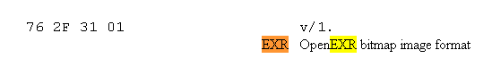

...but the file start with 76 2d 3F 01
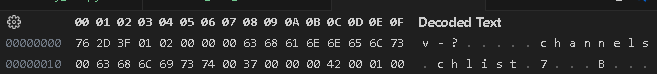

```
─$ okteta whiteandblank
```

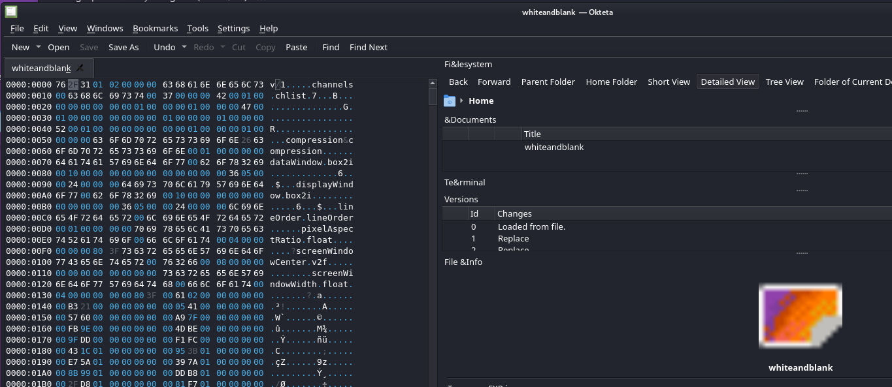

After modification of the header to 76 2d 3F 01, The file is better interpreted by exrinfo  (but still considered bad from exrcheck...)
```
└─$ exrinfo whiteandblank
File 'whiteandblank':
  compression: 'zip'
  displayWindow: [ 0, 0 - 1334 36 ] 1335 x 37
  dataWindow: [ 0, 0 - 63 63 ] 64 x 64
  channels: 3 channels
   'B': half samp 1 1
   'G': half samp 1 1
   'R': half samp 1 1

┌──()-[/mnt/d/DATA/GIT/writeups/AsisCTF2023/UNSOLVED/white_and_blank]
└─$ exrcheck whiteandblank
 file whiteandblank bad
```

Early end of file...
```
python .\checkexr.py .\whiteandblank
An error occurred: Cannot read image file "whiteandblank". Early end of file: read 325911 out of 1677721600 requested bytes.
```

```
└─$ exiftool whiteandblank
ExifTool Version Number         : 12.67
File Name                       : whiteandblank
Directory                       : .
File Size                       : 326 kB
File Modification Date/Time     : 2024:01:02 13:09:04-05:00
File Access Date/Time           : 2024:01:02 15:20:07-05:00
File Inode Change Date/Time     : 2024:01:02 13:09:04-05:00
File Permissions                : -rwxrwxrwx
File Type                       : EXR
File Type Extension             : exr
MIME Type                       : image/x-exr
EXR Version                     : 2
Flags                           : (none)
Channels                        : B half 1 1, G half 1 1, R half 1 1
Compression Compression         : (Binary data 1677721600 bytes, use -b option to extract)

└─$ exiftool -b whiteandblank
Warning: Truncated or corrupted EXR file - whiteandblank
12.67whiteandblank.3260242024:01:02 13:09:04-05:002024:01:02 15:20:07-05:002024:01:02 13:09:04-05:00100777EXREXRimage/x-exr20B half 1 1
G half 1 1
R half 1 1Truncated or corrupted EXR file
```

File seems to be composed of 2 parts....
1- EXR file
2- RAW JPEG ?

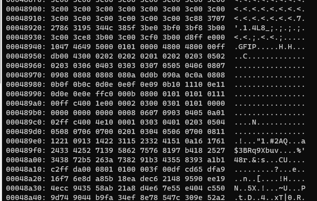


Based on https://en.wikipedia.org/wiki/List_of_file_signatures


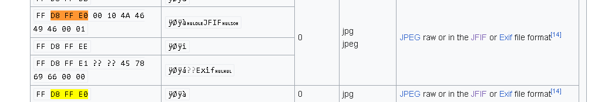

and we have :
whiteandblank file : D8 FF E0 00 10 47 46 49 50 00 01
jpeg RAW           : D8 FF E0 00 10 4A 46 49 46 00 01

Example https://asecuritysite.com/forensics/jpeg?file=image002.jpg


From https://stackoverflow.com/questions/38346442/how-to-check-if-jpg-file-contains-other-types-of-images :: 
""The thumbnail image pixel size is 0x0 in this header""

FF D8 FF E0 00 10 4A 46 49 46 00 01 01 00 00 01 00 01 00 00


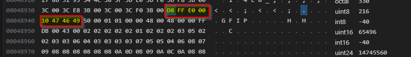


From https://www.ccoderun.ca/programming/2017-01-31_jpeg/

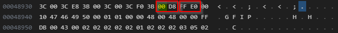

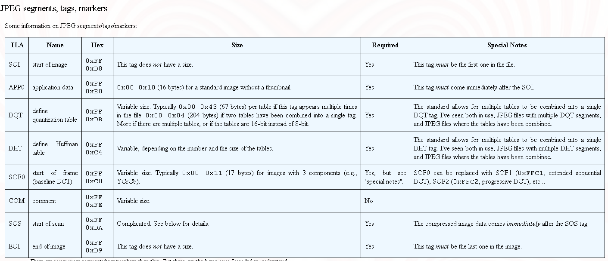

Nothing from foremost, binwalk...etc
```
─$ binwalk whiteandblank
DECIMAL       HEXADECIMAL     DESCRIPTION
-----------------------------------------
```

Let's modify the first byte 00 D8 in FF D8
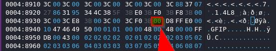


```
└─$ xxd -c16 -g1 -u whiteandblank | grep --color=always  "FF D8"

┌──()-[/mnt/d/DATA/GIT/writeups/AsisCTF2023/UNSOLVED/white_and_blank]
└─$ xxd -c16 -g1 -u whiteandblank | grep --color=always  "FF E0"
00048930: 3C 00 3C E8 3B 00 3C 00 3C F0 3B 00 D8 FF E0 00  <.<.;.<.<.;.....

## After


─$ xxd -c16 -g1 -u whiteandblank | grep --color=always  "FF 8"                                                                                                                                                         
00048930: 3C 00 3C E8 3B 00 3C 00 3C F0 3B FF D8 FF E0 00  <.<.;.<.<.;.....

$ xxd -c16 -g1 -u whiteandblank | grep --color=always  "FF DA"
00048a10: C2 FF DA 00 08 01 01 00 00 3F 00 DF CD 65 DF A9  .........?...e..

┌──
└─$ xxd -c16 -g1 -u whiteandblank | grep --color=always  "FF D9"
0004f980: E0 47 81 4F 08 9A FF D9                          .G.O....
```

```
 python .\extract_jpeg.py
JPEG data extracted to: output.jpg                                           
output.jpg: JPEG image data, baseline, precision 8, 257x1, components 1
```

A this point we have and output.jpeg file that is kind of a white line (257x1).
...TBC


Not exactly full white line...!!!???
From https://29a.ch/photo-forensics/#forensic-magnifier


```
└─$ exiftool output.jpg
ExifTool Version Number         : 12.67
File Name                       : output.jpg
Directory                       : .
File Size                       : 29 kB
File Modification Date/Time     : 2024:01:02 16:55:52-05:00
File Access Date/Time           : 2024:01:02 17:35:50-05:00
File Inode Change Date/Time     : 2024:01:02 16:55:52-05:00
File Permissions                : -rwxrwxrwx
File Type                       : JPEG
File Type Extension             : jpg
MIME Type                       : image/jpeg
Image Width                     : 257
Image Height                    : 1
Encoding Process                : Baseline DCT, Huffman coding
Bits Per Sample                 : 8
Color Components                : 1
Image Size                      : 257x1
Megapixels                      : 0.000257
```


```
python .\extract_jpeg.py
JPEG data extracted to: output.jpg
> python .\jpegsnoopcolors.py
Opening the image file...
Image file opened successfully.
Converting the image to the YCbCr color space...
Image converted successfully.
Splitting the image into its Y, Cb, and Cr channels...
Image split successfully.
Getting the pixel values from the Y channel...
Pixel values obtained successfully.
Checking for pixel values greater than 255...
No modification.
```

# openEXR format review

1./Compilation of an EXR writer for format example from https://openexr.com/en/latest/HelloWorld.html?highlight=writer.cpp#hello-world

hello.exr :
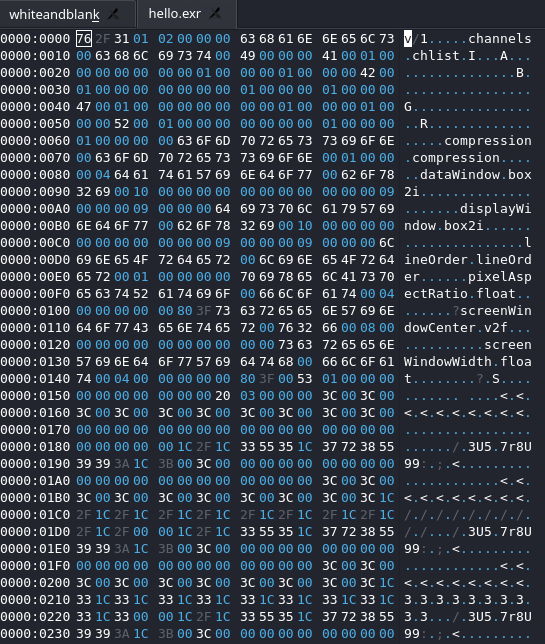


2./Installation of a VStudio extension that can visuzalize .exr files 
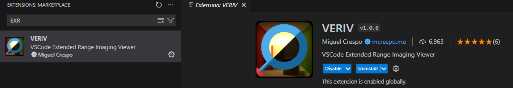
...ok but will open of course only correct openEXR files


3./Review of the OpenEXR layout https://openexr.com/en/latest/OpenEXRFileLayout.html

4./Review of https://openexr.com/en/latest/OpenEXRFileLayout.html#sample-file
and https://github.com/annguyen-ilm/openexr/blob/1545_fix_formatting_sample_exr/website/OpenEXRFileLayout.rst

So 80 3F 00 is the end of the oepenEXR header :
```
└─$ xxd -c16 -g1 -u whiteandblank | grep --color=always  "80 3F 00"
00000130: 04 00 00 00 00 00 80 3F 00 61 02 00 00 00 00 00  .......?.a......
```

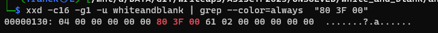


At this point we have an EXR file:
-with a displayWindow larger than dataWindow...
-An EXR file that have an "early ending" anf a end of file that is a JPEG (247 x 1 pixels)
```
└─$ exrinfo whiteandblank
File 'whiteandblank':
  compression: 'zip'
  displayWindow: [ 0, 0 - 1334 36 ] 1335 x 37
  dataWindow: [ 0, 0 - 63 63 ] 64 x 64
  channels: 3 channels
   'B': half samp 1 1
   'G': half samp 1 1
   'R': half samp 1 1


└─$ cd OPENXR/


└─$ exrinfo hello.exr
File 'hello.exr':
  compression: 'piz'
  displayWindow: [ 0, 0 - 9 9 ] 10 x 10
  dataWindow: [ 0, 0 - 9 9 ] 10 x 10
  channels: 4 channels
   'A': half samp 1 1
   'B': half samp 1 1
   'G': half samp 1 1
   'R': half samp 1 1
   
└─$ exrcheck whiteandblank
 file whiteandblank bad


└─$ exrheader whiteandblank
Cannot read image file "whiteandblank". Early end of file: read 325911 out of 1677721600 requested bytes.
```


From https://openexr.com/en/latest/TechnicalIntroduction.html  the difference between "display Window" and "data Window" is clearer...so the "display Window" is supposed to be smaller...

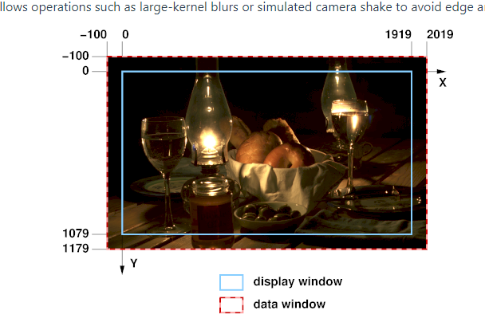


From https://openexr.com/en/latest/StandardAttributes.html  :

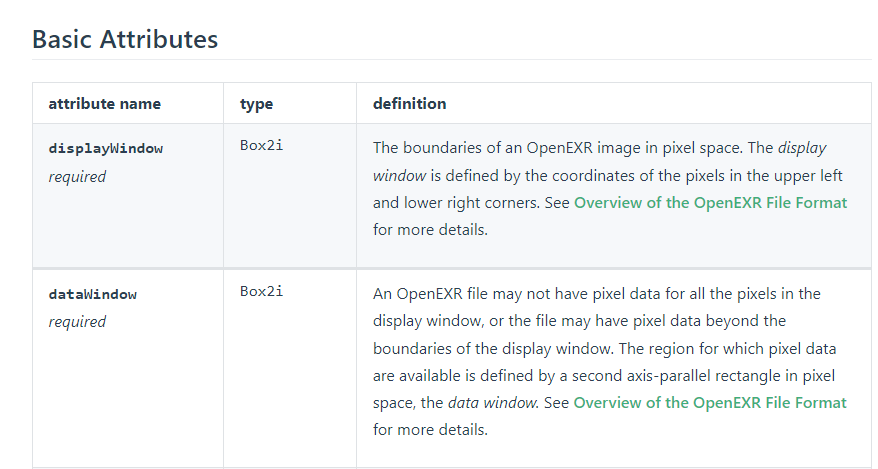


WITH ImHex : 
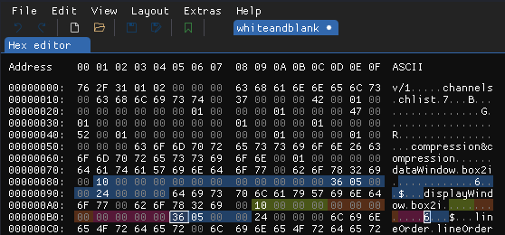

Compared to the layout https://github.com/annguyen-ilm/openexr/blob/1545_fix_formatting_sample_exr/website/OpenEXRFileLayout.rst
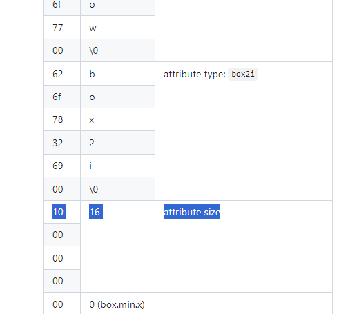


Finally  displayWindow: [ 0, 0 - 1334 36 ] 1335 x 37

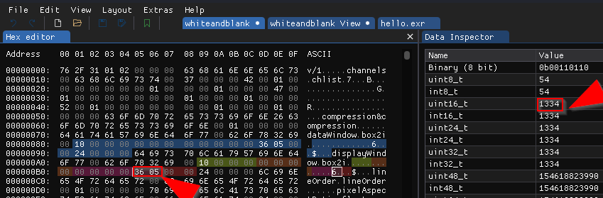

36 05  become 00 24:
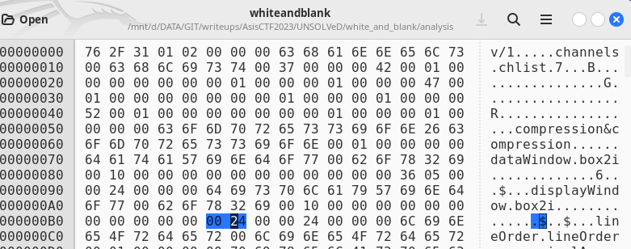

Resulting in...
```
$ exrinfo whiteandblank
File 'whiteandblank':
  compression: 'zip'
  displayWindow: [ 0, 0 - 9216 36 ] 9217 x 37
  dataWindow: [ 0, 0 - 63 63 ] 64 x 64
```

Then 36 05  becoming 24 00:

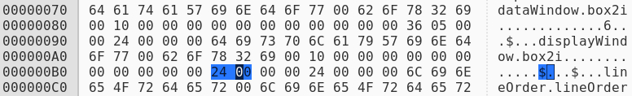

results in DisplayWindow: [ 0, 0 - 36 36 ] 37 x 37
```
$ exrinfo whiteandblank
File 'whiteandblank':
  compression: 'zip'
  displayWindow: [ 0, 0 - 36 36 ] 37 x 37
  dataWindow: [ 0, 0 - 63 63 ] 64 x 64
  channels: 3 channels
   'B': half samp 1 1
   'G': half samp 1 1
   'R': half samp 1 1


but still...

└─$ exrheader  whiteandblank
exrheader: Cannot read image file "whiteandblank". Early end of file: read 325911 out of 1677721600 requested bytes.
```

A this point we now have an EXR file with a displayWindow smaller than the dataWindow and also the first modification of header to 76 2d 3F 01 helping the file to be better interpreted by exrinfo.


To get more eventually more detailed information about the error, checkexr.py  script is updated to catch a detailed exception (but...The Python OpenEXR library does not provide detailed information about the file structure )
```
PS D:\DATA\GIT\writeups\AsisCTF2023\UNSOLVED\white_and_blank\analysis> python .\checkexrdebug.py .\whiteandblank
An error occurred: Cannot read image file "whiteandblank". Early end of file: read 325911 out of 1677721600 requested bytes.
Stacktrace: Traceback (most recent call last):
  File "D:\DATA\GIT\writeups\AsisCTF2023\UNSOLVED\white_and_blank\analysis\checkexrdebug.py", line 10, in <module>
    exr_file = OpenEXR.InputFile(file_path)
OSError: Cannot read image file "whiteandblank". Early end of file: read 325911 out of 1677721600 requested bytes.
```

We can retrieve the sources files that implement the error message found :
OpenEXR/ImfStdIO.cpp is the "low-level fil input and output for OpenEXR based on C++ standard iostreams"
```
()-[~/openexr/src/lib]
└─$ grep -ri "Early end" *                                                                                                                                                                                            
OpenEXR/ImfStdIO.cpp:                "Early end of file: read " << is.gcount () << " out of "
OpenEXRUtil/ImfCheckFile.cpp:                "Early end of file: requesting "
OpenEXRUtil/ImfCheckFile.cpp:                "Early end of file: requesting "


```

From ImfStdIO.cpp
```
checkError (istream& is, streamsize expected = 0)
 {    
     if (!is) 
     {
         if (errno) IEX_NAMESPACE::throwErrnoExc ();
 
         if (is.gcount () < expected)
         {
             THROW (
                 IEX_NAMESPACE::InputExc,
                 "Early end of file: read " << is.gcount () << " out of "
                                            << expected << " requested bytes.");
         }
         return false;
     }
 
     return true;
 }

```

Let's try to have exrheader updated to provide detailed HEXA adresses related to the istream object by modifying the checkError function to print the current position of the istream object in hexadecimal format when an error occurs. Here's a minimal modification:

```cpp
bool
checkError (istream& is, streamsize expected = 0)
{
    if (!is)
    {
        if (errno) IEX_NAMESPACE::throwErrnoExc ();

        if (is.gcount () < expected)
        {
            std::streampos pos = is.tellg();
            std::stringstream ss;
            ss << std::hex << pos;
            THROW (
                IEX_NAMESPACE::InputExc,
                "Early end of file at position 0x" << ss.str() << ": read " << is.gcount () << " out of "
                                           << expected << " requested bytes.");
        }
        return false;
    }

    return true;
}
```

This modification uses the tellg function to get the current position of the istream object, then converts it to a hexadecimal string using a stringstream. The hexadecimal position is then included in the error message. This modification will only print the position of the istream object at the time the error is detected, which may not be the exact position of the error in the file if the file is read in chunks. Also, the position is relative to the start of the file, not the start of the disk or the file system.

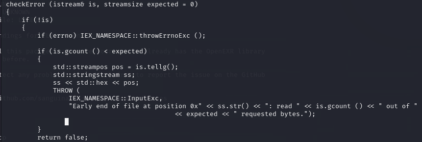


So we modify [~/openexr/src/lib/OpenEXR/ImfStdIO.cpp as per above and recompile 
```
cd openexr
mkdir build
cd build
cmake ..
sudo make install


#check that the compilation of ImfStdIO.cpp.o is OK
....
42%] Building CXX object src/lib/OpenEXR/CMakeFiles/OpenEXR.dir/ImfStdIO.cpp.o
[ 42%] Building CXX object src/lib/OpenEXR/CMakeFiles/OpenEXR.dir/ImfStringAttribute.cpp.o


─$ exrheader whiteandblank                                                                                                                                                                                               
exrheader: Cannot read image file "whiteandblank". Early end of file at position 0xffffffffffffffff: read 325911 out of 1677721600 requested bytes.
...
```

We need to understand the adress of last read at 325911 bytes and understand considering that the file whiteandblank have a size of 326024 bytes so 1677721600 requested bytes is impossible


The OpenEXR file format begins with a header that includes several fields, one of which is the data window that describes the dimensions of the image. The library ----likely--- uses this information to calculate the expected size of the image data.

The error message indicates that the library tried to read 1677721600 bytes, which is much larger than the actual file size of 326024 bytes. This suggests that the data window in the header is incorrect.

Here's a brief overview of the OpenEXR header structure:

The first four bytes are the magic number, which should be 76 2f 31 01.
The next byte is the version field.
After the version field, the header includes a series of attributes. Each attribute consists of a name, a type, a size, and a value. The names are null-terminated strings, the types are also null-terminated strings, the size is a 4-byte integer, and the value is a sequence of bytes with the specified size.
One of the attributes is the data window, which is represented as a box2i type. This type consists of two V2i types, each of which consists of two 4-byte integers. The first V2i represents the minimum coordinates of the data window, and the second V2i represents the maximum coordinates.


## Review of the hypothesis of the size calculation based on ImfInputFile.cpp

From [ImfInputFile.cpp](../analysis/exrheader/src/lib/OpenEXR/ImfInputFile.cpp) we can observe that for the Initialization of InputFile, The InputFile constructor calls initialize(), where it checks the type of the image (DeepScanLine, Tiled, ScanLine) and initializes the corresponding file type (dsFile, tFile, sFile) based on the header information, including the dataWindow.

Setting FrameBuffer: In setFrameBuffer(), there's a process to match the user-provided frame buffer with the internal representation. This part of the code handles the dimensions defined by dataWindow to ensure that the buffer is correctly sized and offset.

Reading Pixels: The readPixels() function is crucial for determining how the dataWindow affects the reading size. For tiled and scanline-based files, different methods (bufferedReadPixels for tiled, sFile->readPixels for scanline) are used to read the pixel data. These functions take into account the dataWindow to determine the range of pixels to be read and processed.

Error Handling: The error handling in functions like readPixels() ensures that any attempt to read outside the dataWindow boundaries is flagged, preventing reading invalid or non-existent data.

From this analysis, it's clear that the dataWindow plays a significant role in determining the size of the image data that is read and processed. The functions in ImfInputFile.cpp use dataWindow to establish boundaries and sizes for reading and processing image data.


## Tests with dataWindow size

Changing adress 0x00000081 - 0x00000081 (0x1 |    from HEX value 10 to 20 we have the displayWindow and datawindow at the same size  (but still the Early end of file error)

```
$ exrinfo whiteandblank
File 'whiteandblank':
  compression: 'zip'
  displayWindow: [ 0, 0 - 63 63 ] 64 x 64
  dataWindow: [ 0, 0 - 63 63 ] 64 x 64
  channels: 3 channels
   'B': half samp 1 1

$ exrheader whiteandblank                                                                                 
exrheader: Cannot read image file "whiteandblank". Early end of file at position 0xffffffffffffffff: read 325911 out of 1677721600 requested bytes.
```

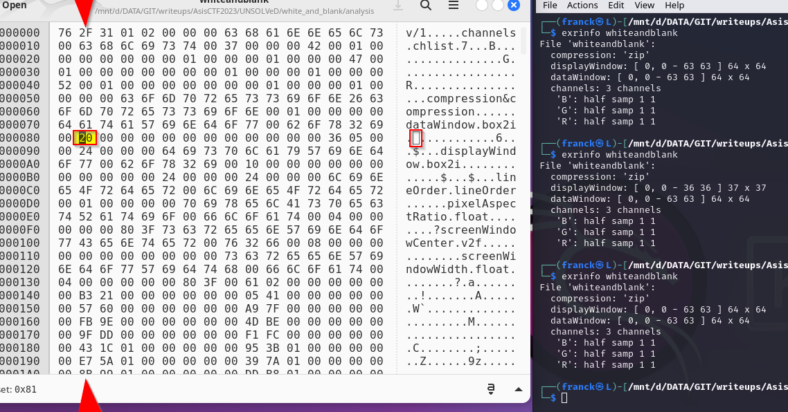

## Tests with previously generated legitimate EXR file

From Exwriter exemple [hello.exr](../analysis/exrwriter/hello.exr) we could get insight on the right OpenEXR format


Unfortunately Bindiff (/opt/bindiff/bin --ui) will not be useful in this case as the whiteandblank fails to be opened

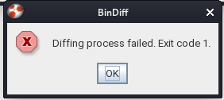
```
# https://github.com/google/bindiff/releases
wget https://github.com/google/bindiff/releases/download/v8/bindiff_8_amd64.deb   
 sudo apt install  ./bindiff_8_amd64.deb

/opt/bindiff/bin --primary whiteandblank --secondary hello.exr | more                
Error: parsing failed for exported file: whiteandblank                                                                                                              
BinDiff 8 (@568181968, Sep 25 2023), (c)2004-2011 zynamics GmbH, (c)2011-2023 Google LLC.    
```

Whith Ghydra we get for whiteandblank :
```
Minimum Address:00000000
Maximum Address:0004f987
# of Bytes:326024
```

Interesting link even if not directly related to this challenge: https://ihack4falafel.github.io/Patch-Diffing-with-Ghidra/

After checking Whith Ghydra differences on headers, it is Interesting to find that there is a signicative difference on the **compression** parameter !

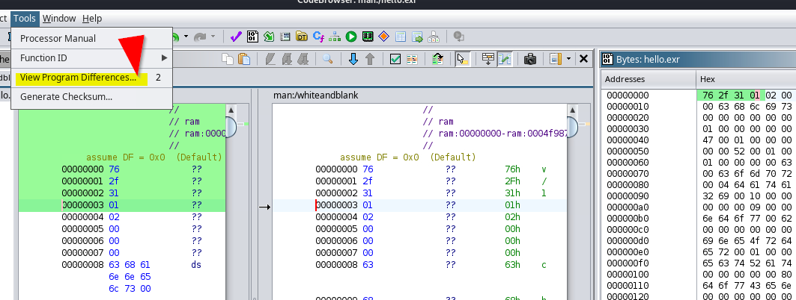

In whiteandblank the compression parameter  have an "ampersand" in the middle as "compression&compression" ...

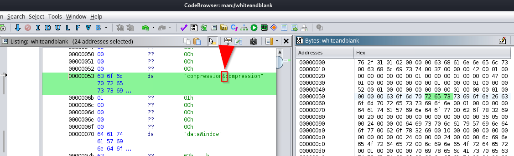

...but a legitimate EXR file ref 
https://openexr.com/en/latest/OpenEXRFileLayout.html is not separated by an ampersand ;-)...

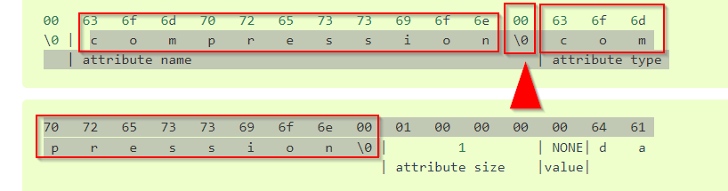

So we want to test a fix of this "issue" : a 26 to 00 then :
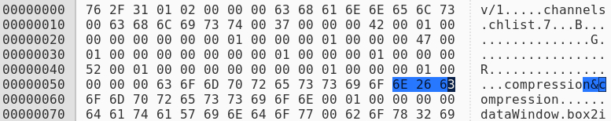

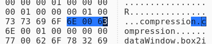

and yes the magic happen, the file is now recognized correctly :


```
exrheader whiteandblank                                                                                  

file whiteandblank:

file format version: 2, flags 0x0
channels (type chlist):
    B, 16-bit floating-point, sampling 1 1
    G, 16-bit floating-point, sampling 1 1
    R, 16-bit floating-point, sampling 1 1
compression (type compression): none
dataWindow (type box2i): (0 0) - (1334 36)
displayWindow (type box2i): (0 0) - (36 36)
lineOrder (type lineOrder): increasing y
pixelAspectRatio (type float): 1
screenWindowCenter (type v2f): (0 0)
screenWindowWidth (type float): 1
type (type string): "scanlineimage"
```

We can now open the file in gimp :-)
We are getting closer...but this is not yet finished


Another interesting tool to compare binaries is ImHex with the (View >> Diffing function), with this we can more easily compare for example the CTF file and a legitimate file header.

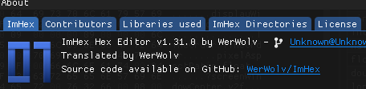

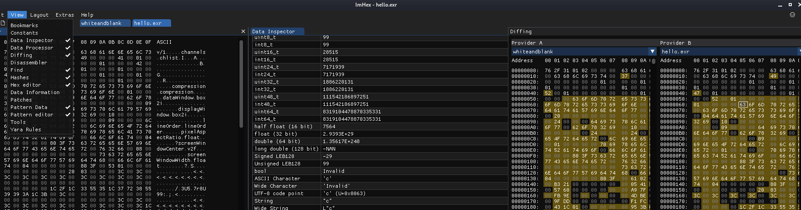


Earlier in the analysis, another peculiar observation was that the tail of the file was composed of a JPEG file 

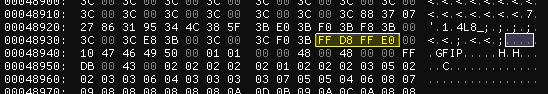


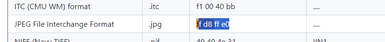
ref https://gist.github.com/leommoore/f9e57ba2aa4bf197ebc5

```
3C 00 3C 00 3C 00 3C 00 3C 00 3C 00 3C 88 37 07 27 86 31 95 34 4C 38 5F 3B E0 3B F0 3B F8 3B 00 3C 00 3C E8 3B 00 3C 00 3C F0 3B FF D8 FF E0 00 10 47 46 49 50 00 01 01 00 00 48 00 48 00 00 FF DB 00 43 00 02 02 02 02 02 01 02 02 02 03 05 02 02 03 03 06 04 03 03 03 03 07 05 05 04 06 08 07
```

Difficult to identify what is ""GFIP"" however ??
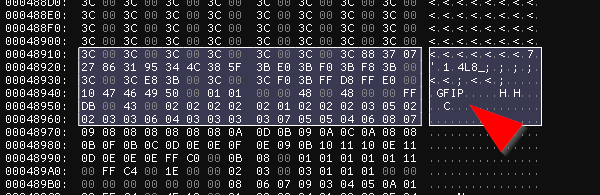

In Imhex  the String beginning is ...\xFF\xD8\xFF\xE0\x00\x10GFIP\x00\x01\... : 
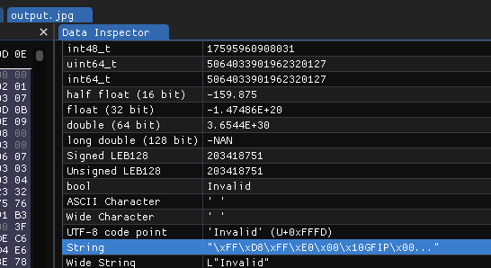


The previously extracted JPEG is seen corrupted for Gimp, so ... is this another level of complication of the challenge ?

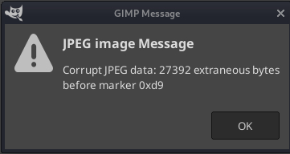
Anyway Gimp is able to open the JPEG file that is displayed as a line  :
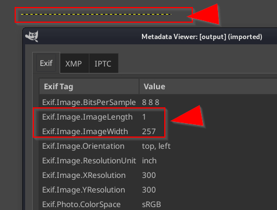.

According to Gimp metadata the JPEG file is seen as quite small (257 x 1 ).

Let's extract it with foremost:

```
└─$ foremost -v whiteandblank
Foremost version 1.5.7 by Jesse Kornblum, Kris Kendall, and Nick Mikus
Audit File

Foremost started at Sun Jan 14 16:39:44 2024
Invocation: foremost -v whiteandblank 
Output directory: /tmp/output
Configuration file: /etc/foremost.conf
Processing: whiteandblank
|------------------------------------------------------------------
File: whiteandblank
Start: Sun Jan 14 16:39:44 2024
Length: 318 KB (326024 bytes)
 
Num      Name (bs=512)         Size      File Offset     Comment 

0:      00000580.jpg          28 KB          297275      
*|
Finish: Sun Jan 14 16:39:44 2024

1 FILES EXTRACTED


 file 00000580.jpg                                                                                                                                                               
00000580.jpg: JPEG image data, baseline, precision 8, 257x1, components 1
```

With ImHex we can use the Pattern fonctionnality to have better visibility on the file
File >> IMport >> Pattern file >>  jpeg.hexpat

We can then navigate on the header with preloaded bookmarks and compare to the standard sections https://docs.fileformat.com/image/jpeg/ and https://en.wikipedia.org/wiki/JPEG_File_Interchange_Format


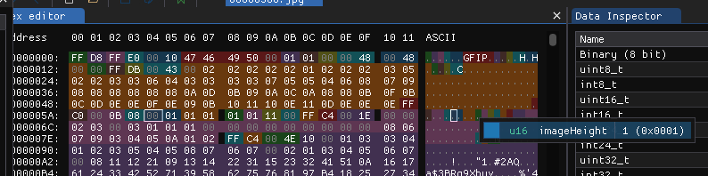

A first test is to try with the initial values of the EXR :

```
displayWindow: [ 0, 0 - 1334 36 ] 1335 x 37
```

So using, for example ImHex Tool base converter I get a new sizing :

imageHeight new:(0x0537)  (before:):(7)(0x0001)
imageWidth  new:(0x0025)  (before:):(257)(0x0101)


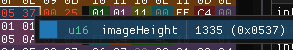

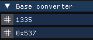


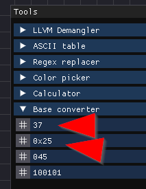

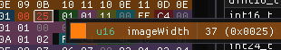

At this point we are getting closer as there are visible letters when opened with Gimp ;-)

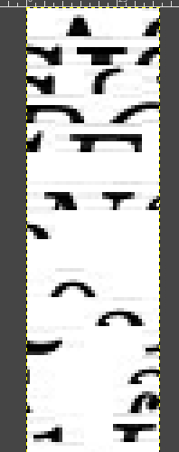

Then we continue to play with the sizes .

Finally 1523 X 1523 is OK () but still not ok.. for gimp but no problem) 

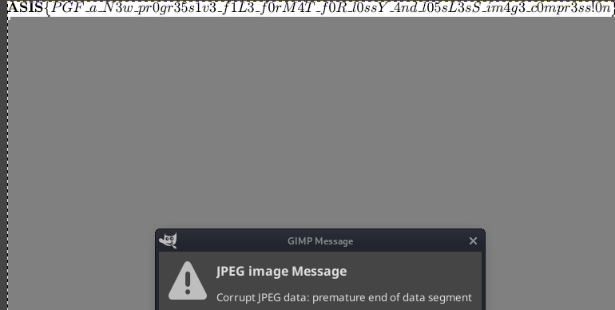

An then, behold,  finally we get the FLAG !! (logically with height=37=0x25, all is OK)

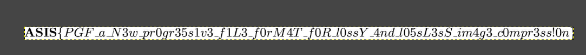

# THE FLAG :

```
ASIS{PGF_a_N3w_pr0gr35s1v3_f1L3_f0rM4T_f0R_l0ssY_4and_l05sL3sS_im4g3_c0mpr3ss!0n}
```