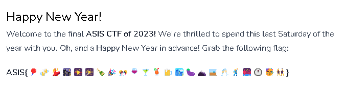

# Challenge

Happy New Year!
Welcome to the final ASIS CTF of 2023! We're thrilled to spend this last Saturday of the year with you. Oh, and a Happy New Year in advance! Grab the following flag:

ASIS{🎈🍻💃🌃🎆🎇🍾🎉🎊🍷🍸🍹🍺🏙️🍆🗻🥃🥂🕺🌉🕛🥳👯}

# Emoji to text
via check_emoji.py

ASIS{:balloon::clinking_beer_mugs::woman_dancing::night_with_stars::fireworks::sparkler::bottle_with_popping_cork::party_popper::confetti_ball::wine_glass::cocktail_glass::tropical_drink::beer_mug::cityscape::eggplant::mount_fuji::tumbler_glass::clinking_glasses::man_dancing::bridge_at_night::twelve_o’clock::partying_face::people_with_bunny_ears:}

balloon::
clinking_beer_mugs::
woman_dancing::
night_with_stars::
fireworks::
sparkler::
bottle_with_popping_cork::
party_popper::
confetti_ball::
wine_glass::
cocktail_glass::
tropical_drink::
beer_mug::
cityscape::
eggplant::
mount_fuji::
tumbler_glass::
clinking_glasses::
man_dancing::
bridge_at_night::
twelve_o’clock::
partying_face::
people_with_bunny_ears

# emojipedia

The url https://emojipedia.org/new-years-eve points exactly to the same sequence of emojis ?

# WRONG FLAGS
ASIS{New Year's Eve}
ASIS{New_Year's_Eve}
ASIS{eggplant}
ASIS{new-years-eve}
ASIS{new_years_eve}
ASIS{new_year_eve}
ASIS{New_Years_Eve}
ASIS{New_Year_s_Eve}
ASIS{New_Year%27s_Eve}
ASIS{https://emojipedia.org/new-years-eve}
ASIS{Happy New Year!}
ASIS{bcwnfsbpcwctbcemtcmbtpp}
ASIS{Happy_New_Year!}
ASIS{Happy_New_Year}

