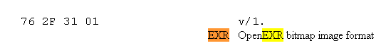
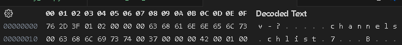
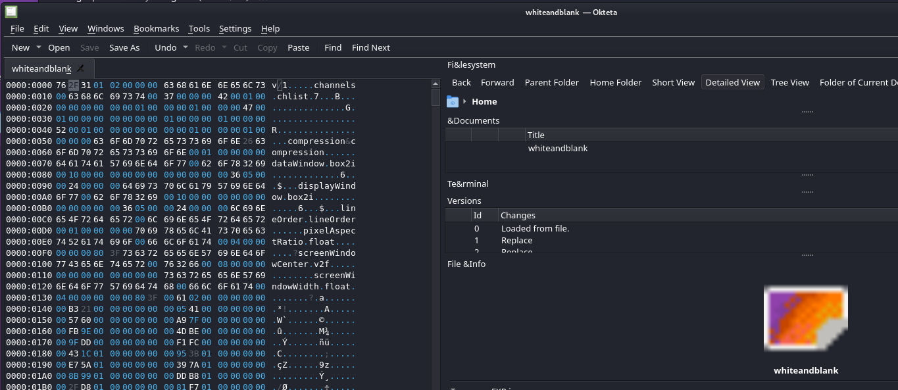
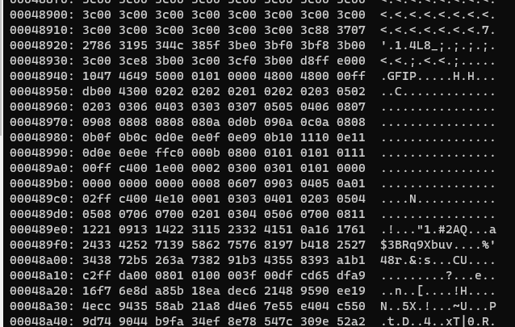
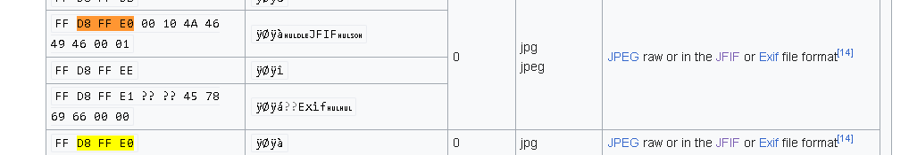
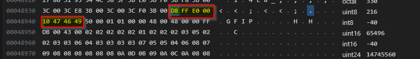
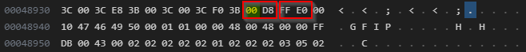
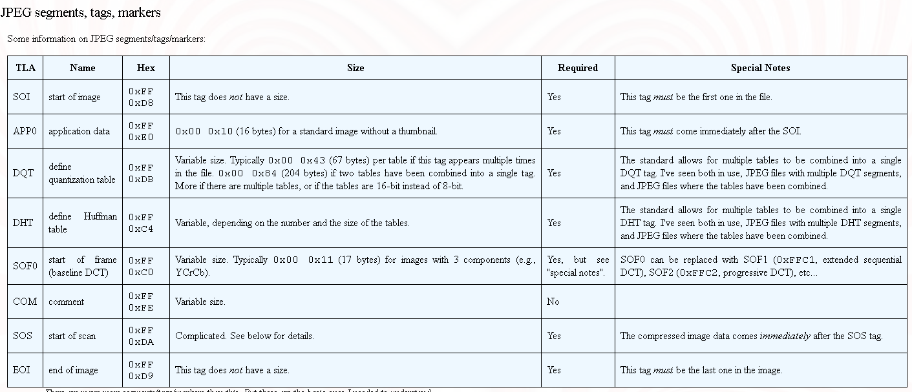
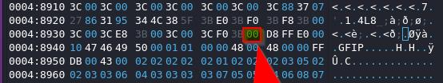

# Challenge White & Blank


Dive into a vibrant and straightforward miscellaneous challenge White & Blank, tailored for enthusiasts exploring the intricacies of 🧡💛💚forensics🧡💛💚.


# Analysis


From the strings in the file it looks like a file in openEXR format https://openexr.com/en/latest/
```
strings whiteandblank | more
channels
chlist
compression&compression
dataWindow
box2i
displayWindow
box2i
lineOrder
lineOrder
pixelAspectRatio
float
?screenWindowCenter
screenWindowWidth
float
;w;v:
9&:g;
```

# Install openexr
```
https://openexr.com/en/latest/install.html#install
% sudo apt-get update
% sudo apt-get install openexr
```

## # Install openexr from sources
To use exrcheck on Kali Linux, you need to build it from the OpenEXR source code. Here are the steps:
```
sudo apt-get install cmake libopenexr-dev
git clone https://github.com/AcademySoftwareFoundation/openexr.git
cd openexr
mkdir build
cd build
cmake ..
make


└─$ exrcheck --version
exrcheck (OpenEXR) 3.3.0 https://openexr.com
Copyright (c) Contributors to the OpenEXR Project
License BSD-3-Clause

exrcheck whiteandblank
 file whiteandblank bad
```

But an openexr file format is supposed to start with 76 2F 31 01

https://www.garykessler.net/library/file_sigs.html



...but the file start with 76 2d 3F 01


```
─$ okteta whiteandblank
```



After modification of the header to 76 2d 3F 01, The file is better interpreted by exrinfo  (but still considered bad from exrcheck...)
```
└─$ exrinfo whiteandblank
File 'whiteandblank':
  compression: 'zip'
  displayWindow: [ 0, 0 - 1334 36 ] 1335 x 37
  dataWindow: [ 0, 0 - 63 63 ] 64 x 64
  channels: 3 channels
   'B': half samp 1 1
   'G': half samp 1 1
   'R': half samp 1 1

┌──()-[/mnt/d/DATA/GIT/writeups/AsisCTF2023/UNSOLVED/white_and_blank]
└─$ exrcheck whiteandblank
 file whiteandblank bad
```

Early end of file...
```
python .\checkexr.py .\whiteandblank
An error occurred: Cannot read image file "whiteandblank". Early end of file: read 325911 out of 1677721600 requested bytes.
```

```
└─$ exiftool whiteandblank
ExifTool Version Number         : 12.67
File Name                       : whiteandblank
Directory                       : .
File Size                       : 326 kB
File Modification Date/Time     : 2024:01:02 13:09:04-05:00
File Access Date/Time           : 2024:01:02 15:20:07-05:00
File Inode Change Date/Time     : 2024:01:02 13:09:04-05:00
File Permissions                : -rwxrwxrwx
File Type                       : EXR
File Type Extension             : exr
MIME Type                       : image/x-exr
EXR Version                     : 2
Flags                           : (none)
Channels                        : B half 1 1, G half 1 1, R half 1 1
Compression Compression         : (Binary data 1677721600 bytes, use -b option to extract)

└─$ exiftool -b whiteandblank
Warning: Truncated or corrupted EXR file - whiteandblank
12.67whiteandblank.3260242024:01:02 13:09:04-05:002024:01:02 15:20:07-05:002024:01:02 13:09:04-05:00100777EXREXRimage/x-exr20B half 1 1
G half 1 1
R half 1 1Truncated or corrupted EXR file
```

File seems to be composed of 3 parts....
- EXR file
- corrupted part with (inferior sign <)
- RAW JPEG ?




Based on https://en.wikipedia.org/wiki/List_of_file_signatures




and we have :
whiteandblank file : D8 FF E0 00 10 47 46 49 50 00 01
jpeg RAW           : D8 FF E0 00 10 4A 46 49 46 00 01

Example https://asecuritysite.com/forensics/jpeg?file=image002.jpg


From https://stackoverflow.com/questions/38346442/how-to-check-if-jpg-file-contains-other-types-of-images :: 
""The thumbnail image pixel size is 0x0 in this header""

FF D8 FF E0 00 10 4A 46 49 46 00 01 01 00 00 01 00 01 00 00





From https://www.ccoderun.ca/programming/2017-01-31_jpeg/





Nothing from foremost, binwalk...etc
```
─$ binwalk whiteandblank
DECIMAL       HEXADECIMAL     DESCRIPTION
-----------------------------------------
```

Let's modify the first byte 00 D8 in FF D8



```
└─$ xxd -c16 -g1 -u whiteandblank | grep --color=always  "FF D8"

┌──()-[/mnt/d/DATA/GIT/writeups/AsisCTF2023/UNSOLVED/white_and_blank]
└─$ xxd -c16 -g1 -u whiteandblank | grep --color=always  "FF E0"
00048930: 3C 00 3C E8 3B 00 3C 00 3C F0 3B 00 D8 FF E0 00  <.<.;.<.<.;.....

## After


─$ xxd -c16 -g1 -u whiteandblank | grep --color=always  "FF 8"                                                                                                                                                         
00048930: 3C 00 3C E8 3B 00 3C 00 3C F0 3B FF D8 FF E0 00  <.<.;.<.<.;.....

$ xxd -c16 -g1 -u whiteandblank | grep --color=always  "FF DA"
00048a10: C2 FF DA 00 08 01 01 00 00 3F 00 DF CD 65 DF A9  .........?...e..

┌──
└─$ xxd -c16 -g1 -u whiteandblank | grep --color=always  "FF D9"
0004f980: E0 47 81 4F 08 9A FF D9                          .G.O....


```

```
 python .\extract_jpeg.py
JPEG data extracted to: output.jpg                                           
output.jpg: JPEG image data, baseline, precision 8, 257x1, components 1
```

A this point we have and output.jpeg file that is kind of a white line (257x1).
...TBC