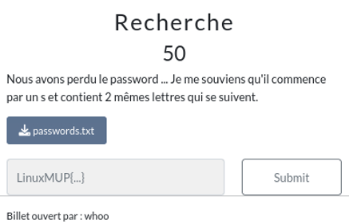
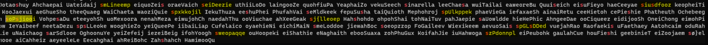

# Challenge




# Challenge

```
$ grep --color s passwords.txt
Ootaoshuy Ahchaepai Uateidaij smLineemp eiquoZeis oraeVaich seiDeezie uthiiLoDo laingooZe quohfiuPa YeaphaiZo vekuSeech sinarella leeChaesa wuiTailai eaweoreBu Quuiseich eisuFieyo haeCeeyae siusdfooz keopheiTi KooJaexui aeGhueSho theeQuaeg WaiChaeta waoziQuie spxkkojil IekuThuza eeshuPhei PhufahVai seMldkeek fepuSusha taiQuioth Mephohroj spUlkppek phaeVieGa iefaxaeSh ainaiRetu ceeHietoh cePieshie Phatheuth Ochebeegh soPsjiooi VohpesaDu eteeyohSh uoMexoora nenahMeza eiwujohCh naedahThu ooViuchae ahXeeGeak sj{lleoep Hahshohdo ohpohShai tohNaiTuv pahJaepie saUowldde hieHePhic AhngeeDae ooCiqueez eidijooSh OneiChong eimohPiow IeYaibeef neetaDezu spsLLeoke wooghieZo yeiQueePe iibaiLiap Cufelaico oyaehieNi eichiMaiN smeLoddoe jiewahBoc soeopzzop FoGaileev Wiexikeem aevuoSais spGLsDDed vuejahRao Raofaekis uFaethaey Aatohcaim oduRahlie uNaichaog sarSdlooe OghoonuYe yeiZefeij iezeiBeig ifohYoogh sweopaqqe ouHoopeki eiShathie eNaghaith ebooSuaxa zohPhuGux KoifahJie iuHahwoga szPdonnpl eiPeubohk gaulahCue houFieshi geebinieT eiZoojaem sø}elmooe aiCahheiz aeyeeleLe Eecahghai ahReiBohc Zahshahch HamimooQu
```




On identifie que la 3eme lettre de chaque mot qui commence par s vont former le flag

```
smLineemp seiDeezie sinarella siusdfooz spxkkojil seMldkeek spUlkppek soPsjiooi sj{lleoep saUowldde spsLLeoke smeLoddoe soeopzzop spGLsDDed sarSdlooe sweopaqqe szPdonnpl  sø}elmooe
```


# Flag
```
LinuxMUP{UseeGreP}
```